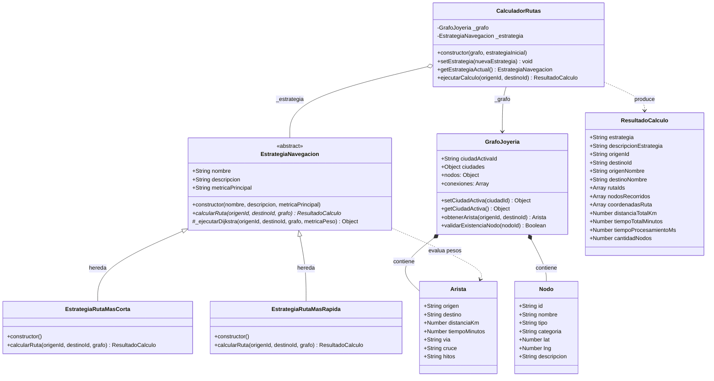
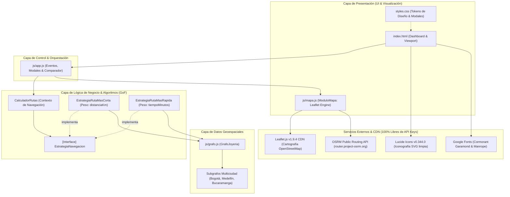
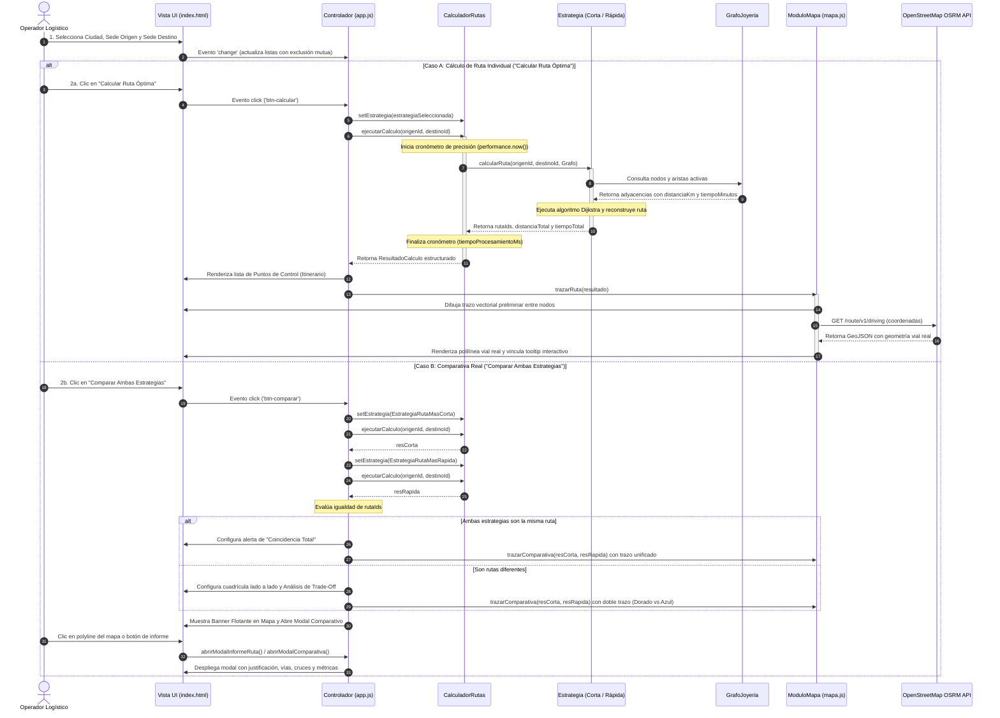
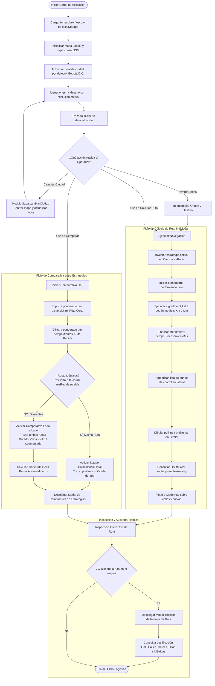

# Módulo de Logística y Optimización de Rutas de Despacho
## Joyería Nudo de Oro — Arquitectura de Software (Unidad 3: Estrategias de Navegación)

Este proyecto corresponde a un prototipo funcional para la asignatura de **Arquitectura de Software**, enfocado en resolver el problema de recorrido óptimo en el despacho de joyas de alto valor y recolección de insumos en la ciudad de Bogotá, Colombia.

El núcleo de la solución implementa de manera estricta el **Patrón de Diseño de Comportamiento Strategy (Gang of Four - GoF)** junto con el algoritmo **Dijkstra** y visualización geoespacial interactiva mediante **Leaflet.js** y **OpenStreetMap** (100% libre, sin requerimiento de API Keys).

---

## 🏛️ 1. Arquitectura y Patrón Strategy (GoF)

### Justificación Arquitectónica
En operaciones de logística de alta seguridad para joyería, el concepto de "mejor ruta" varía según las condiciones del entorno:
- **Criterio A (Minimizar Distancia):** Reduce el kilometraje físico y consumo de combustible. Útil en horarios de bajo tráfico o vías despejadas.
- **Criterio B (Minimizar Tiempo / Tráfico):** Reduce los minutos de exposición en las vías públicas ante congestión severa o semaforización lenta, enviando la carga blindada por vías arterias rápidas aunque el trayecto sea físicamente más largo.

El **Patrón Strategy** permite desacoplar la interfaz gráfica y los servicios de despacho de la lógica matemática del cálculo, posibilitando el cambio de algoritmo en caliente (*runtime*) mediante polimorfismo.

### 📐 Diagramas UML de Arquitectura

> [!NOTE]
> La documentación completa con detalles extendidos y matrices de correspondencia se encuentra en [`docs/DIAGRAMAS_UML.md`](file:///c:/Users/Jaime%20Zapata/Documents/actividad-seis/docs/DIAGRAMAS_UML.md).

#### 1. Diagrama de Clases (Patrón Strategy GoF)


#### 2. Diagrama de Componentes


#### 3. Diagrama de Secuencia


#### 4. Diagrama de Actividad / Flujo del Recorrido



### Componentes de la Arquitectura
1. **Interfaz / Clase Base Abstracta (`EstrategiaNavegacion`):**
   - Declara la firma del método `calcularRuta(origenId, destinoId, grafo)`.
   - Provee la implementación genérica de Dijkstra que puede parametrizarse según la métrica (`distanciaKm` o `tiempoMinutos`).
2. **Estrategia Concreta A (`EstrategiaRutaMasCorta`):**
   - Sobrescribe `calcularRuta()`, instruyendo al algoritmo Dijkstra a ponderar los arcos por menor distancia física.
3. **Estrategia Concreta B (`EstrategiaRutaMasRapida`):**
   - Sobrescribe `calcularRuta()`, instruyendo al algoritmo a ponderar los arcos por menor tiempo en minutos (considerando congestión urbana).
4. **Contexto (`CalculadorRutas`):**
   - Mantiene una referencia a la estrategia activa.
   - Provee el método `setEstrategia()` para alternar el algoritmo en tiempo de ejecución.
   - En `ejecutarCalculo()`, delega la ejecución al objeto estrategia y cronometra el rendimiento con `performance.now()`.


---

## 🗺️ 2. Estructura de Datos (Grafo Multiciudad Nacional)

El sistema ahora soporta cobertura logística en **tres ciudades clave** de Colombia mediante un grafo geoespacial estructurado en [`js/grafo.js`](file:///c:/Users/Jaime%20Zapata/Documents/actividad-seis/js/grafo.js):

### 1. Bogotá D.C. (Red Expandida - 18 Nodos)
- **Talleres y Proveedores:** Taller Central Candelaria, Proveedor Centro Oro, Proveedor Gemas del Eje, Sucursal Galerías, Sucursal Gran Estación.
- **Clientes y Boutiques:** Cliente VIP Chapinero, Rosales Alto, Parque 93, Santa Ana Exclusive, Boutique Usaquén, Unicentro Norte, Cedritos Boutique, Colina Campestre, Plaza Suba, Salitre Plaza, Modelia Occidental, Kennedy Central, Santa Bárbara.

### 2. Medellín (Valle de Aburrá y Oriente - 8 Nodos)
- **Talleres y Proveedores:** Taller Nudo de Oro El Poblado (Milla de Oro), Proveedor Junín Joyero (Centro), Sucursal Parque Laureles.
- **Clientes y Boutiques:** El Tesoro Parque Comercial, Envigado Jardines, Sabaneta Parque, Belén Rosales, Finca Llanogrande (Rionegro).

### 3. Bucaramanga (Área Metropolitana y Meseta - 8 Nodos)
- **Talleres y Proveedores:** Taller Nudo de Oro Cabecera (Cra 33), Proveedor Joyero Calle 35, Sucursal Cañaveral Mall (Floridablanca).
- **Clientes y Boutiques:** Sotomayor Exclusivo, San Francisco, Provenza Real, Girón Monumental, Ruitoque Country Club.

Cada arista entre dos nodos incluye dos pesos calibrados para modelar la realidad del tráfico urbano:
- `distanciaKm`: Longitud en kilómetros.
- `tiempoMinutos`: Tiempo estimado de traslado considerando congestión, semaforización y corredores de seguridad.

### Caso de Estudio Clave: Taller Central &rarr; Cliente Usaquén
- **Ruta Más Corta (Distancia):**
  - Recorrido: *Taller Central &rarr; Proveedor Centro &rarr; Chapinero &rarr; Parque 93 &rarr; Usaquén*
  - Distancia: **15.1 km** (más corta)
  - Tiempo: **78 min** (más lenta debido al tráfico del Centro y Cra 7ma)
- **Ruta Más Rápida (Tiempo con Tráfico):**
  - Recorrido: *Taller Central &rarr; Salitre Plaza &rarr; Santa Bárbara &rarr; Usaquén*
  - Distancia: **19.7 km** (más larga)
  - Tiempo: **46 min** (¡ahorra 32 minutos utilizando corredores rápidos!)

---

## ⚡ 3. Medición de Rendimiento con `performance.now()`

El método `ejecutarCalculo` en `CalculadorRutas` mide el tiempo exacto en milisegundos que le toma a la CPU resolver el grafo y reconstruir el camino:
```javascript
const tInicio = performance.now();
const resultadoCalculo = this._estrategia.calcularRuta(origenId, destinoId, this._grafo);
const tFin = performance.now();
const tiempoProcesamientoMs = Number((tFin - tInicio).toFixed(4));
```
La latencia obtenida se sitúa típicamente entre **0.05 ms** y **0.45 ms**, garantizando un rendimiento en tiempo real idóneo para sistemas de despacho.

---

## 🚀 4. Modo de Uso y Ejecución

El proyecto está diseñado para ser **100% autocontenido y listo para usar**.

### Opción 1: Ejecución Directa (Doble Clic)
1. Navega a la carpeta del proyecto: `actividad-seis`.
2. Haz doble clic en el archivo `index.html`.
3. Se abrirá de inmediato en cualquier navegador web moderno (Chrome, Edge, Firefox, Safari) sin requerir instalación de servidores, Node.js ni tokens.

### Opción 2: Ejecución de las Pruebas Unitarias (Node.js)
Para verificar la lógica algorítmica y el cumplimiento del patrón en consola:
```bash
node test/test_estrategias.js
```
Salida esperada:
```
✅ [PASS] EstrategiaNavegacion no se puede instanciar directamente (Clase Base Abstracta).
✅ [PASS] EstrategiaRutaMasCorta es subclase de EstrategiaNavegacion.
✅ [PASS] EstrategiaRutaMasRapida es subclase de EstrategiaNavegacion.
✅ [PASS] CalculadorRutas inicializa con la estrategia inyectada.
✅ [PASS] setEstrategia() actualiza dinámicamente la estrategia activa.
✅ [PASS] EstrategiaRutaMasCorta produce una distancia menor o igual en km.
✅ [PASS] EstrategiaRutaMasRapida produce un tiempo menor o igual en minutos.
✅ [PASS] El tiempo de procesamiento medido con performance.now() es un número válido.
```

---

## 📂 5. Estructura del Proyecto

```
actividad-seis/
│
├── index.html              # Interfaz web principal, Dashboard y contenedor Leaflet.js
├── README.md               # Documentación académica de arquitectura y guía de uso
├── css/
│   └── styles.css          # Sistema de diseño de lujo (Glassmorphism, Luxury Gold & Midnight Slate)
├── js/
│   ├── grafo.js            # Grafo en memoria con 8 nodos reales de Bogotá y aristas con doble métrica
│   ├── estrategias.js      # Implementación del Patrón Strategy (GoF), Dijkstra y CalculadorRutas
│   ├── mapa.js             # Módulo Leaflet.js (OpenStreetMap, marcadores custom, red y polylines)
│   └── app.js              # Controlador principal de la UI, eventos y comparador de estrategias
└── test/
    └── test_estrategias.js # Suite de pruebas automatizadas en consola
```

---

## 🎓 6. Créditos y Asignatura
- **Asignatura:** Arquitectura de Software
- **Unidad:** Unidad 3 - Estrategias de Navegación en la Arquitectura de Software
- **Caso de Aplicación:** Joyería Nudo de Oro — Despacho y Recolección Segura de Joyas
- **Patrón:** Strategy (Patrones de Diseño Gang of Four)
- **Tecnologías:** JavaScript ES6+, Leaflet.js, OpenStreetMap, HTML5 semántico, CSS3 Flexbox/Grid.
