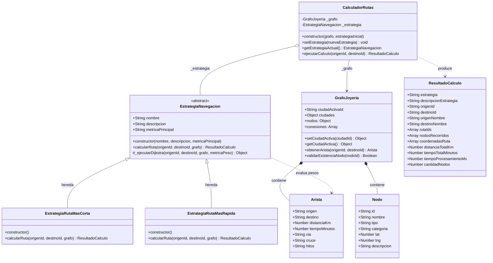
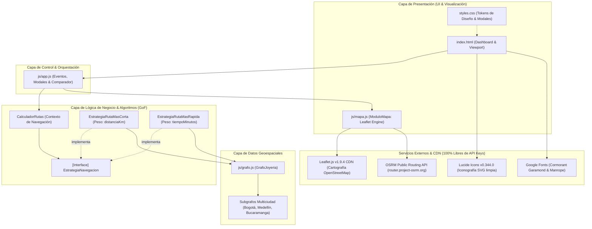
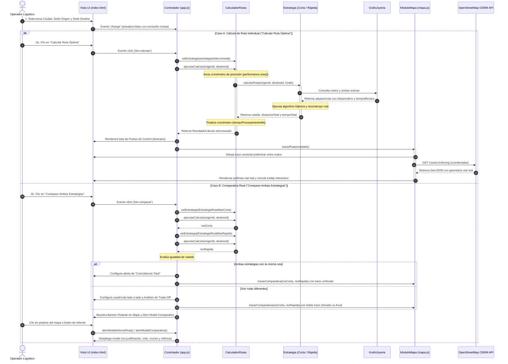
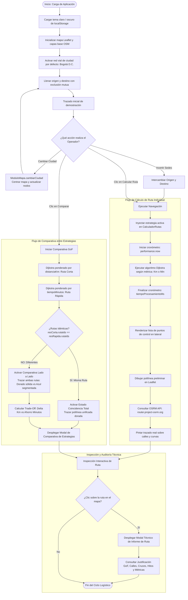

# Joyería Nudo de Oro — Módulo de Navegación y Logística
## Documento de Arquitectura de Software: Diagramas UML Oficiales
### Asignatura: Arquitectura de Software • Unidad 3: Estrategias de Navegación

Este documento contiene la especificación formal y gráfica de los **cuatro (4) diagramas UML obligatorios** correspondientes al sistema de optimización de rutas de despacho blindado de **Joyería Nudo de Oro**, implementado bajo el **Patrón de Diseño de Comportamiento Strategy (Gang of Four - GoF)**.

> [!TIP]
> Todos los diagramas han sido testeados para renderizado nativo en **GitHub Markdown** utilizando la sintaxis estándar de **Mermaid.js**.

---

## 📑 Índice de Diagramas
1. [Diagrama de Clases (Patrón Strategy GoF)](#1-diagrama-de-clases-patrón-strategy-gof)
2. [Diagrama de Componentes](#2-diagrama-de-componentes)
3. [Diagrama de Secuencia](#3-diagrama-de-secuencia)
4. [Diagrama de Actividad / Flujo del Recorrido](#4-diagrama-de-actividad--flujo-del-recorrido)
5. [Matriz de Correspondencia Arquitectónica](#5-matriz-de-correspondencia-arquitectónica)

---

## 1. Diagrama de Clases (Patrón Strategy GoF)

### Descripción
El diagrama de clases modela la estructura estática del sistema. Evidencia la aplicación rigurosa del **Patrón Strategy (GoF)**, desacoplando la clase de contexto (`CalculadorRutas`) de los algoritmos concretos mediante la abstracción `EstrategiaNavegacion`. Además, se detallan las estructuras del grafo (`GrafoJoyeria`, `Nodo`, `Arista`) y el objeto de transferencia de datos enriquecido (`ResultadoCalculo`).

### Roles del Patrón Strategy
- **Contexto (`CalculadorRutas`):** Mantiene una referencia al objeto `EstrategiaNavegacion`. Permite cambiar la estrategia dinámicamente en tiempo de ejecución con `setEstrategia()` y cronometra el rendimiento con `performance.now()`.
- **Estrategia Abstracta (`EstrategiaNavegacion`):** Define el contrato uniforme `calcularRuta()` y encapsula el algoritmo base Dijkstra parametrizado.
- **Estrategia Concreta 1 (`EstrategiaRutaMasCorta`):** Pondera aristas priorizando la menor distancia física en kilómetros (`distanciaKm`).
- **Estrategia Concreta 2 (`EstrategiaRutaMasRapida`):** Pondera aristas priorizando la menor duración temporal en minutos con congestión (`tiempoMinutos`).

---

## 2. Diagrama de Componentes

### Descripción
El diagrama de componentes ilustra la organización en capas del sistema, sus dependencias y las interfaces con servicios externos de código abierto (OpenStreetMap OSRM y Leaflet CDN).

---

## 3. Diagrama de Secuencia

### Descripción
Representa la interacción temporal y el intercambio de mensajes entre los objetos cuando el usuario solicita calcular una ruta individual o comparar ambas estrategias en tiempo real.

---

## 4. Diagrama de Actividad / Flujo del Recorrido

### Descripción
Describe el flujo de control y las decisiones de negocio desde que se carga el sistema hasta que se inspecciona la ruta óptima para el transporte de valores.

---

## 5. Matriz de Correspondencia Arquitectónica

| Concepto Arquitectónico | Elemento en el Código | Justificación y Función |
| :--- | :--- | :--- |
| **Contexto (Strategy Pattern)** | [`CalculadorRutas`](file:///c:/Users/Jaime%20Zapata/Documents/actividad-seis/js/estrategias.js#L243) | Alberga la estrategia activa y ejecuta polimórficamente `calcularRuta()`. |
| **Abstracción / Interfaz** | [`EstrategiaNavegacion`](file:///c:/Users/Jaime%20Zapata/Documents/actividad-seis/js/estrategias.js#L14) | Clase abstracta con el contrato y algoritmo genérico Dijkstra. |
| **Estrategia Concreta A** | [`EstrategiaRutaMasCorta`](file:///c:/Users/Jaime%20Zapata/Documents/actividad-seis/js/estrategias.js#L162) | Minimiza `distanciaKm` (consumo de combustible y kilometraje de flota). |
| **Estrategia Concreta B** | [`EstrategiaRutaMasRapida`](file:///c:/Users/Jaime%20Zapata/Documents/actividad-seis/js/estrategias.js#L198) | Minimiza `tiempoMinutos` (exposición al tráfico y seguridad del cargamento). |
| **Grafo Multiciudad** | [`GrafoJoyeria`](file:///c:/Users/Jaime%20Zapata/Documents/actividad-seis/js/grafo.js) | Topología vial con pesos dobles, nombres de vías, cruces e hitos urbanos. |
| **Visualización Geoespacial** | [`ModuloMapa`](file:///c:/Users/Jaime%20Zapata/Documents/actividad-seis/js/mapa.js) | Integración con Leaflet.js y OSRM para dibujo de rutas en tiempo real. |
| **Medición de Rendimiento** | `performance.now()` | Auditoría de tiempo de ejecución asintótico en micro/milisegundos. |
